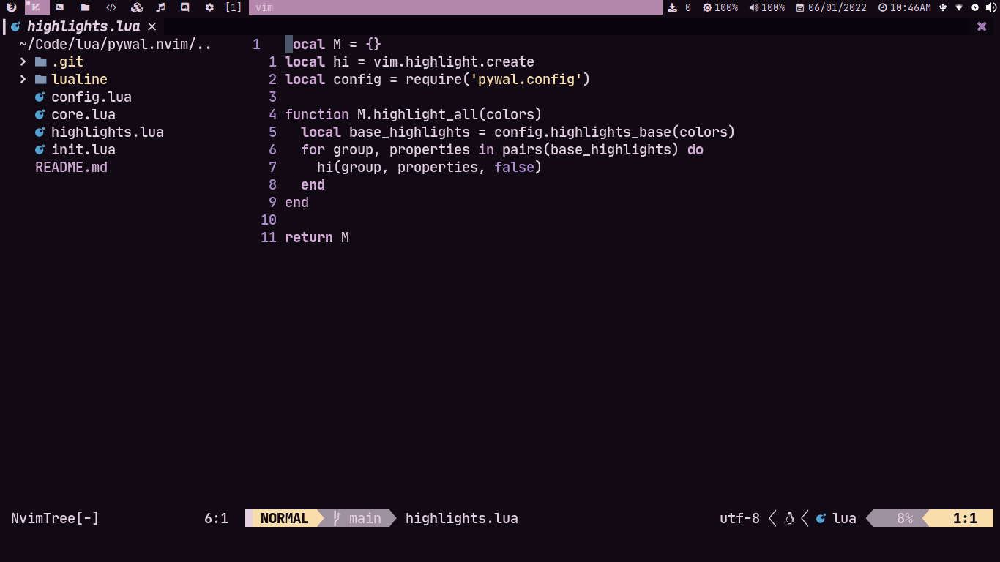
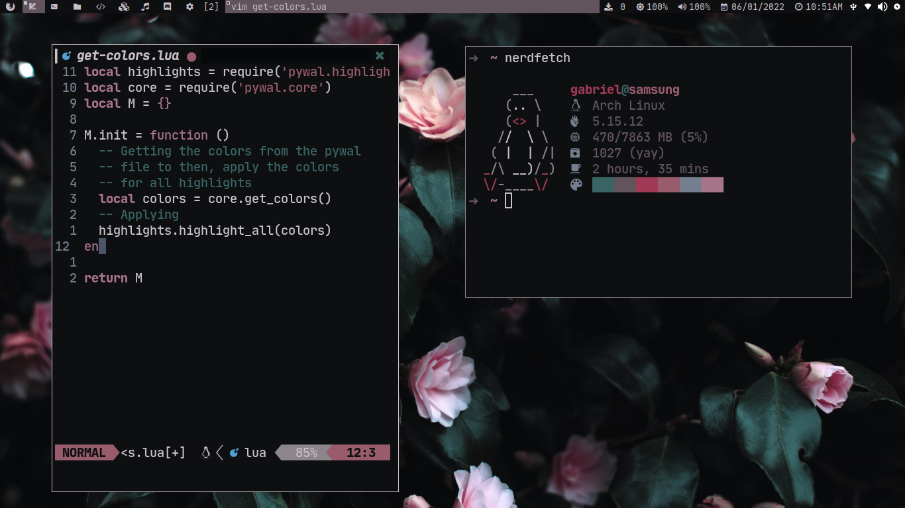

# pywal.nvim

Pywal.nvim is reimplementation of [pywal.vim](https://github.com/dylanaraps/wal.vim)
writted totally in lua, with support for a few nvim lua plugins

## Screenshots




## External Plugin Support

- Telescope
- Nvim Tree
- Tresitter
- Lsp
- Lsp saga
- Coc
- Bufferline
- Illuminate
- Diff
- Git signs
- Git gutter

## Installation

You can install this plugin with packer:

```lua
use { 'AlphaTechnolog/pywal.nvim', as = 'pywal' }
```

Or with vim-plug:

```vim
Plug 'AlphaTechnolog/pywal.nvim', as = 'pywal'
```

## Active theme

To active the theme call this in your neovim config:

```lua
local pywal = require('pywal')

pywal.setup()
```

> It will set automatically the `vim.opt.termguicolors` to true

## Activating lualine theme

Place this in your lualine config:

```lua
local lualine = require('lualine')

lualine.setup {
  options = {
    theme = 'pywal'
  }
}
```

## Using the core to get the colors

If you want to get the colors into a lua dictionary

```lua
local pywal_core = require('pywal.core')
local colors = pywal_core.get_colors()
```

## How it works

Pywal automatically generate a file called `colors-wal.vim` in `~/.cache/wal/colors-wal.vim`,
it file contains all the colors that are necesary to works for vim, it files looks
like this:

```vim
" Special
let wallpaper  = "/home/user/Pictures/winter-purple.jpg"
let background = "#110914"
let foreground = "#e3cfe2"
let cursor     = "#e3cfe2"

" Colors
let color0  = "#110914"
let color1  = "#A378B6"
let color2  = "#B687AD"
let color3  = "#D9A2AF"
let color4  = "#F8DDAD"
let color5  = "#AD90CF"
let color6  = "#D2ACD6"
let color7  = "#e3cfe2"
let color8  = "#9e909e"
let color9  = "#A378B6"
let color10 = "#B687AD"
let color11 = "#D9A2AF"
let color12 = "#F8DDAD"
let color13 = "#AD90CF"
let color14 = "#D2ACD6"
let color15 = "#e3cfe2"
```

The theme only reads it files variables and then create a colors dictionary to create
a theme based in it's colors

## Enjoy

If you like this and my work you can give me a star :)
